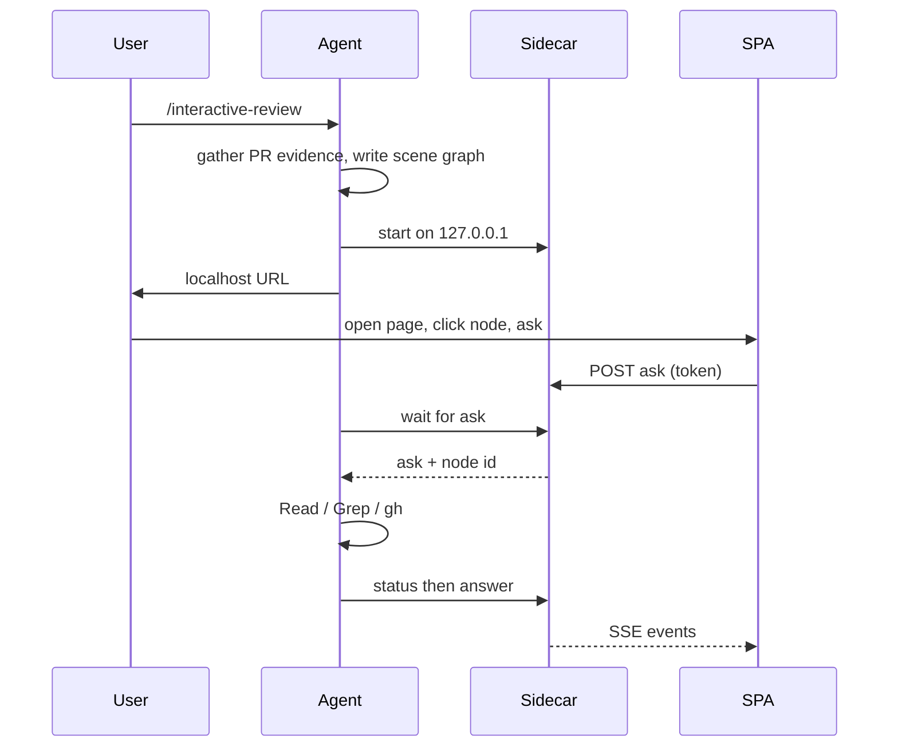

# Interactive review

**Status**: Draft
**Author**: djenriquez (with AI assistance)

## Summary

A developer who needs to understand a pull request runs a new local skill, `/interactive-review`. It opens a localhost page whose diagram is the review surface: click a component, ask a question, and the same agent session that launched the page answers with tools and citations. The page does not call a model. GitHub comments and hosted HTML are out of scope. The session is read-only.

## Problem Statement

Agent-generated pull requests are hard to interpret from a diff. `/pr-figure` already turns the merged end state into one picture, and `/pr-digest` already answers follow-ups, but only inside that chat. Someone who wants to inspect one box still has to reconstruct the architecture, then re-explain which part they mean. This skill is for the developer at their own machine, using their coding harness, not for a GitHub comment.

## Goals / Non-goals

Goals:

- Point the skill at a pull request and get an interactable diagram of the merged end state.
- Click a component (or ask about the whole change), then ask follow-ups in a panel on that page.
- Stream those answers from the launching agent, with visible tool activity and file citations, in the same digest voice used for `/pr-digest`.
- Keep `/pr-figure` as the GitHub PNG skill.

Non-goals:

- Hosting the page on a GitHub branch, GitHub Pages, or any public CDN.
- Editing the working tree, leaving review comments, or giving an approve/reject verdict from the page.
- Making PNG pixels the hit target.
- Wiring host-repo CI that posts PR figures.

## Design

An implementer who finds that a binding constraint or key decision rests on a false premise surfaces it and this spec is amended. Do not silently deviate, and do not silently comply.

When the skill works, the order is: resolve the pull request, gather the same kind of evidence `/pr-figure` uses, skip if there is nothing to draw, write a scene graph, start a localhost sidecar that serves the page, occupy the session in a wait loop, and answer each ask with ordinary read tools. Closing the page or stopping the session ends it.



| Decision | Choice | Why |
|----------|--------|-----|
| Surface | New local skill, not a GitHub Action and not a `/pr-figure` mode | Audience is the developer at a machine, not a GitHub thread |
| Brain | The agent that launched the page | Follow-ups keep session memory; the page must not call a model |
| Wire | Dumb sidecar on loopback; page is a proxy | Browsers cannot speak Cursor, Claude Code, or Codex |
| Lifetime | Skill occupies the session until the page or session stops | Matches “terminal plus page both open” |
| Figure | Scene graph drawn as real boxes and arrows | Image models do not return click coordinates (**interactable-graph**) |
| Mutation | Read-only | Comprehension aid, not a second coding UI |
| Hosting | None in v1 (**no-host**) | A static file cannot be the harness; GitHub raw HTML does not run as an app |

**localhost-only.** The sidecar binds `127.0.0.1`, not `0.0.0.0`. Require `Host: 127.0.0.1`. The printed URL includes `?token=` so the first page load can set a cookie; `/config.js` must not hand out the token to an unauthenticated GET. Browser POST without a bearer token must send a matching `Origin`. A drive-by site must not be able to post asks (**localhost-csrf**).

**proxy-sidecar.** The page sends UI events. The sidecar queues them and pushes agent events to the page. It does not hold API keys or call a model.

**launching-agent.** Every answer comes from the session that ran the skill. Do not spawn a second model “for the page.” Child agents for isolation are out of v1.

**occupy-session.** After the URL is printed, that chat is this skill until shutdown. Do not multiplex other work in the same session.

**read-only.** The agent may `Read`, `Grep`, `Glob`, and `gh`/`git` inspect. It must not edit the working tree, commit, or push because of a page event.

**grounding.** Every box, arrow, and claim has to appear in the gathered pull-request evidence or in a file the agent actually read for that ask. If it is not there, say so. Do not invent architecture. Citations use paths and lines the agent observed.

**no-verdict.** Same stance as `/pr-digest`: explain, do not approve or reject.

**human-voice.** Graph summary, roles, annotations, and every panel answer get the required `digest` humanizer pass before they reach the page. Outcome first, one name per thing, contractions allowed. The page is easier to read when it sounds like a person explaining the figure, not a model dumping types.

**skip-trivial.** Use `/pr-figure`’s skip rule for “nothing to draw.” Do not start the page. There is no image-generator skip: this skill does not paint a PNG.

Shippable bar: one real pull request, interactable figure, click a node, follow-ups, streamed answer with tool activity and citations. Stretch toward a fuller AI-native shell (thinking traces, follow-up chips, `@` mentions, diffs in the panel) and cut what is weak rather than blocking the bar. Decorative motion (3D tilt, orbs) is out of tone.

The page stack is delegated at implementation time. Bounds: no npm install for the person running the skill; no third-party CDN at runtime; the plugin may ship static HTML/CSS/JS; the canvas must make boxes and arrows themselves the hit targets; reduced-motion must not break asking.

Sidecar language is delegated at implementation time. Bounds: Python 3 stdlib so Claude Code, Cursor, and Codex can start it the same way; session files only under `$TMPDIR` / `/tmp`, never the repo.

### Scene graph

The drawing rules in `references/pr-figure.md` still apply: merged end state, numbered actors, control-plane vs data-plane arrows, a mandatory “do not draw” list when lookalikes exist, no function names as box labels. The skill writes JSON the page can render, not an image prompt. Layout is the page’s job (bands from the spec). The graph opens with `summary.problem` and `summary.change` at the top of the page. Nodes carry a short role and evidence pointers so a click can show a brief *before* any ask.

### Sidecar and page

The sidecar serves the static page, `/graph.json`, a long-poll wait for the agent, and an event stream for the page. Asks include the selected node id or `null` for the whole change. Status events (thinking, tool name and target) may precede the answer. Answers are escaped markdown plus citations and optional follow-up chips.

### Watch loop

The agent blocks on wait, handles `ask` or `shutdown`, and loops. Idle wait is not a prompt to invent work. Shutdown happens when the page’s heartbeat stops, the user stops the session, or the page posts stop.

## Alternatives Considered

**GitHub branch HTML.** `blob/…?raw=true` works for PNGs. GitHub serves raw HTML as source or `text/plain`, so the app would not run, and it still could not hold a harness.

**Frozen bundle plus a local model server.** Survives after the agent turn ends, but cannot `Read` a file that was not gathered, and it is a second brain.

**PNG plus a sidebar list.** Ships faster, but the figure itself is not interactable.

**SPA invoking Cursor SDK / `claude -p` per question.** A different product: new runs, weaker follow-up memory, more packaging.

**Extending `/pr-figure`.** That skill’s delivery is a GitHub image. Mixing localhost occupancy into it would blur both jobs.

## Acceptance Criteria

- `/interactive-review` with a pull-request reference (or the current branch’s pull request) opens a `http://127.0.0.1` page whose boxes and arrows are clickable.
- Selecting a node shows its role and evidence without a model call. Asking from that node (or with no selection) yields an answer from the launching agent that can include tool activity and path/line citations.
- A question that is not in the evidence is answered as unknown, not with invented architecture.
- The page cannot edit the repo. The sidecar is not reachable off loopback without the session token.
- Trivial diffs that `/pr-figure` would skip do not start the page.
- `/pr-figure` still hosts a PNG for GitHub and is unchanged in role.

## Open Questions

None that block implementation. Canvas library and how far the first cut takes thinking traces / `@` / diffs remain delegated as above.

## Appendix: Implementation Notes

The appendix is normative. An implementer must read it in full. Inventory verified 2026-08-26 against this worktree (no `docs/specs/` or `interactive-review` skill existed yet).

<details>
<summary>Current system this skill sits beside</summary>

| Path | Role |
|------|------|
| `plugins/djenriquez-core/skills/pr-figure/SKILL.md` | GitHub PNG figure; skip rules and drawing intent reused |
| `plugins/djenriquez-core/references/pr-figure.md` | What to draw, skip, prompt skeleton (actors / arrows / bands). Do not run the raster generator or upload steps |
| `plugins/djenriquez-core/skills/pr-digest/SKILL.md` | Comprehension Q&A stance: no verdict |
| `plugins/djenriquez-core/references/github-pr-workflow.md` | Parse `#N` / URL; current-branch `gh pr view`; do not guess a number; figure-only may use `gh --repo` without checkout |
| `plugins/djenriquez-core/references/harness-adapters.md` | Task/plan tools differ by host; this skill should not need specialist spawn |
| `plugins/djenriquez-core/skills/pr-figure/scripts/upload_github_asset.py` | Do not use. This skill does not host files |

Some repos commit PR figures to a branch from CI. That pipeline is out of scope; this spec does not change it.

</details>

<details>
<summary>New files (starting point; implementer may split)</summary>

| Path | Responsibility |
|------|----------------|
| `docs/specs/interactive-review.md` | This spec |
| `plugins/djenriquez-core/skills/interactive-review/SKILL.md` | Orchestrator: resolve, gather, graph, serve, wait loop, answer |
| `plugins/djenriquez-core/references/interactive-review.md` | Graph schema, HTTP, watch loop, answer JSON. Load only on this skill |
| `plugins/djenriquez-core/skills/interactive-review/scripts/server.py` | Sidecar + `init` / `write-graph` / `validate` / `serve` |
| `plugins/djenriquez-core/skills/interactive-review/web/` | Static page, canvas, panel, EventSource client |
| `plugins/djenriquez-core/skills/interactive-review/scripts/tests/` | Sidecar and schema tests |

Plugin-root `references/` stays unqualified in the skill. Web and scripts stay under the skill directory because they are skill-local binaries/assets.

Update the root `README.md` skills list and plugin descriptions when the skill exists. Do not bump marketplace version in this spec.

</details>

<details>
<summary>PR resolve and gather</summary>

Reuse `references/github-pr-workflow.md`. Arguments: `#N`, `N`, or `https://github.com/OWNER/REPO/pull/N`. If omitted, `gh pr view` for the current branch; ask if none.

Prefer the pull request’s `OWNER/REPO` over the checkout. Local checkout of that head is optional. Gather: title, body, files, `gh pr diff` or `git diff <base>...HEAD` when this checkout *is* the head, plus the most important changed files (same bias as `/pr-digest`: core over tests/config). Ground the graph only in that evidence.

Skip without starting the sidecar when the diff has no behavior, flow, architecture, or user-visible outcome to draw.

</details>

<details>
<summary>Scene graph JSON</summary>

Write under the session directory as `graph.json`. Validate before serve. Starting schema (implementer may add fields, not remove these):

```json
{
  "title": "short figure title",
  "pr": { "url": "https://github.com/OWNER/REPO/pull/N", "number": 1, "title": "PR title" },
  "bands": [{ "id": "control", "label": "Control plane" }],
  "nodes": [
    {
      "id": "upload",
      "label": "Upload script",
      "band": "control",
      "role": "one or two sentences, end-state, grounded",
      "column": 0,
      "bullets": ["optional short line"],
      "evidence": [{ "path": "skills/foo.py", "start_line": 10, "end_line": 40 }]
    }
  ],
  "edges": [
    {
      "id": "e1",
      "from": "upload",
      "to": "comment",
      "kind": "control",
      "label": "optional short label"
    }
  ],
  "do_not_draw": ["rejected sibling"],
  "annotations": ["cardinality or freeze rule a reviewer would miss"],
  "summary": {
    "problem": "what is wrong today",
    "change": "what this PR does about it"
  }
}
```

`kind` is one of `control`, `data-happy`, `data-other`, `once`. Edge `from`/`to` must be node ids. Node `label` is one to three words; quote verbatim strings that must appear. No function, type, or file-path box labels. Map the `/pr-figure` skeleton 1:1: nested actor bullets stay on the canvas via `bullets` and `sections`. Default `layout` is `landscape` (bands as columns). Same-pair edges are fanned. Optional `column`, `subtitle`. `summary.problem` and `summary.change` render at the top of the page. `annotations` render on the canvas. `do_not_draw` is required when the change is easy to confuse with a sibling design. Humanize summary, roles, annotations, and panel answers in `digest` mode; leave field lists verbatim.

The page lays out nodes by `band`. Missing `bands` may be inferred from node `band` values. Do not ask an image model for coordinates.

</details>

<details>
<summary>HTTP API (starting point)</summary>

Bind `127.0.0.1`, ephemeral port. Print one JSON object to stdout: `url`, `token`, `port`, `session_dir`. Serve web assets from the skill `web/` directory. Overlay session files from `--session`.

| Method | Path | Caller | Purpose |
|--------|------|--------|---------|
| GET | `/` | page | SPA |
| GET | `/config.js` | page | heartbeat config (auth required; no token in JS) |
| GET | `/graph.json` | page | scene graph |
| GET | `/ui/events` | page | SSE: `hello`, `status`, `answer`, `graph`, `shutdown` |
| POST | `/ui/ask` | page | `{ "node_id": string\|null, "text": string }` → `{ "ask_id": string }` |
| POST | `/ui/heartbeat` | page | every few seconds |
| POST | `/ui/stop` | page | shutdown |
| GET | `/agent/wait?timeout=25` | agent | `{ "type": "ask"\|"shutdown"\|"idle", ... }` |
| POST | `/agent/reload-graph` | agent | re-read session `graph.json`; broadcast SSE `graph` |
| POST | `/agent/status` | agent | `{ "ask_id", "kind": "thinking"\|"tool"\|"text", "label", "detail"? }` |
| POST | `/agent/answer` | agent | see answer JSON below |

Mutating routes and `/agent/*` require `Authorization: Bearer <token>`. `Host` must be `127.0.0.1`. Browser POST must send `Origin: http://127.0.0.1:<port>`; agent curl uses the bearer token and omits `Origin`. `pr.url` must be http(s) with no credentials. Heartbeat miss (1h after the last page ping) triggers shutdown. Stop shuts it down immediately. Do not implement CORS `*` .

Answer JSON:

```json
{
  "ask_id": "…",
  "markdown": "plain explanation",
  "citations": [{ "path": "foo.py", "start_line": 10, "end_line": 20 }],
  "follow_ups": ["optional chip text"],
  "unknown": false
}
```

The page HTML-escapes markdown. Do not execute scripts from answers. Citations must be paths the agent read or that were on the selected node’s `evidence`. Humanize `markdown` and `follow_ups` before POST.

</details>

<details>
<summary>Watch loop and answer turn</summary>

1. `init` session dir under `$TMPDIR`.
2. Write `graph.json`; `validate`.
3. `serve` in the background; read stdout JSON.
4. Tell the user the URL. Occupying the session starts now.
5. Loop: `GET /agent/wait`. `idle` → wait again. `shutdown` → kill the server, stop. `ask` → post `thinking` / `tool` status as tools run, then `POST /agent/answer`.
6. For each ask: treat `node_id` as the scope; `null` is the whole change. Use tools. If the answer needs a file not yet read, read it. If still unknown, `unknown: true`.
7. No working-tree writes, no `git commit`, no `git push`, no `gh pr comment` from this loop.

Harness note: Cursor, Claude Code, and Codex all run this as the foreground agent looping on wait. There is no browser-to-agent protocol. The sidecar *is* that protocol. Do not busy-poll faster than the wait timeout.

</details>

<details>
<summary>UI bar vs stretch</summary>

Bar: band layout canvas; hover highlights a node and its edges; click selects and dims the rest; zoom/pan; node panel with role, evidence, thread, composer; connection state; tool chips from `status`; citations; optional `follow_ups` chips that submit as the next ask; annotation callouts; fanned labels on parallel edges.

Stretch: collapsible thinking, `@` node/file mentions in the composer, showing a cited hunk in the panel. Cut rather than fake.

Out of tone: marketing 3D, confetti, fluid orbs.

</details>

<details>
<summary>Read-only tool policy</summary>

Allowed in the skill frontmatter: `Read`, `Grep`, `Glob`, `AskUserQuestion`, `Bash` limited to `git` inspect, `gh` inspect, `python3` sidecar, `curl` to `127.0.0.1`. Session files only via the sidecar CLI into `$TMPDIR`.

Forbidden as a result of a page event: `Write`/`Edit`/`StrReplace` on the repo, applying patches, tests that mutate, `gh pr review`, force-push.

</details>
